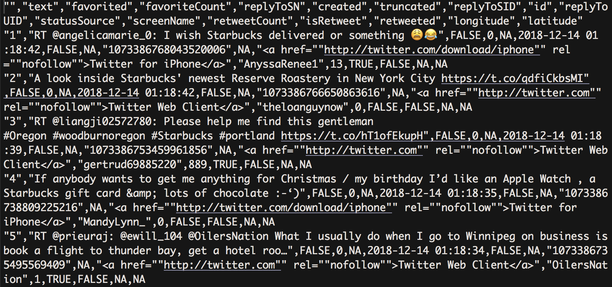
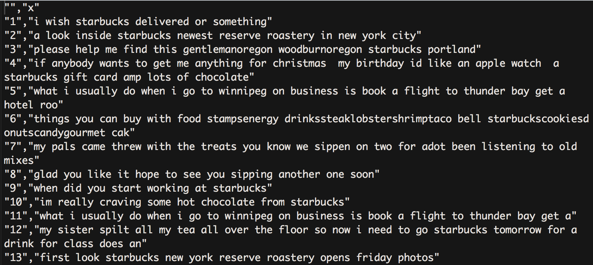
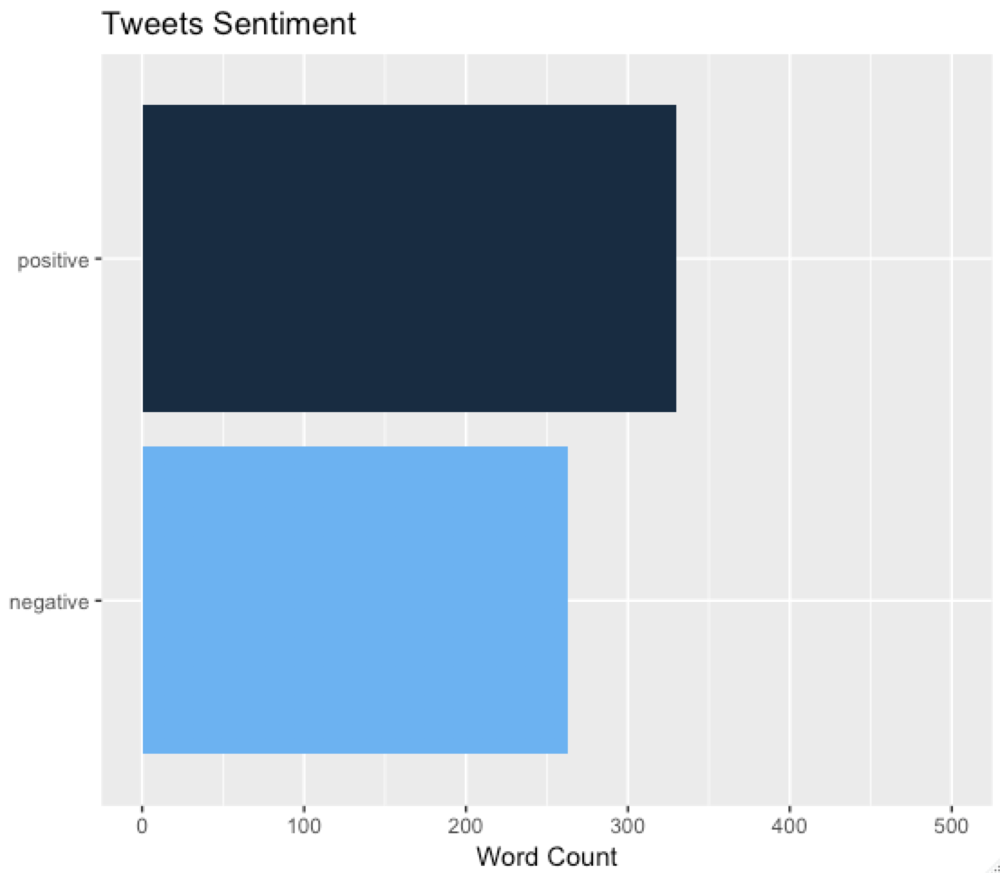
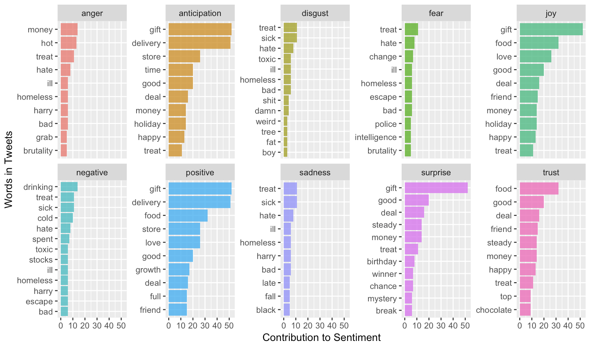

```{r setup, include = FALSE}
knitr::opts_chunk$set(
  collapse = TRUE,
  comment = "#>"
)
```

# Sentiment Analysis for Twitter Data  

> "Twitter is what’s happening in the world and what people are talking about right now."  
- twitter.com

To view Twitter, visit <https://twitter.com/>

This package contains functions that allows users to scrape twitter data and conduct sentiment analysis of the tweets on different coffee shops. 

The coffee package has five functions suited for this purpose: 

  * get_tweets()
  * clean_tweets() 
  * make_wordcloud()
  * make_bar_graph()
  * make_cat_graph() 

## Scraping Twitter Data 

### 1) get_tweets
This function allows users to save tweets that contain a specified keyword into a .csv file named keyword_tweets.csv (replace "keyword" for the word you want to search).

The get_tweets() function takes in two arguments, the keyword and the number of tweets. The default number of tweets saved is 500.  

*In the example image below, the user has searched for the keyword "starbucks" and this is the output .csv file.*

```get_tweets("starbucks")```
```{r, out.width = "600px", echo=FALSE}

```

### 2) clean_tweets
This function allows users to clean tweets from the .csv file previously saved from the get_tweets() function and then save these cleaned tweets into a new file named clean_keyword_tweets.csv.

Cleaning the tweets includes removing numbers, hashtags, urls, "RT"'s, twitter usernames, punctuation, emojis, new lines, and leading and trailing white space. It also makes all the tweets lowercase. 

The clean_tweets() function take in one argument, the .csv file created from get_tweets(). 

*In the example image below, the user has cleaned the starbucks_tweets.csv and this is the output file.*

```clean_tweets("starbucks_tweets.csv")```
```{r, out.width = "600px", echo=FALSE}

```

## Sentiment Analysis Visualizations 

### 3) make_wordcloud
A wordcloud is used to highlight popular words based on the frequency of use and prominence in the tweets.

This function allows users to make a word cloud given a .csv file from the clean_tweets() function. 

The make_wordcloud() function takes in two arguments, the clean .csv file and the number of words included in the word cloud. 

### 4) make_bar_graph
This bar graph shows how many words in the tweets are "positive" and how many are "negative" from the given .csv file 

This function allows users to make a sentiment bar graph given a .csv file from the clean_tweets() function. 

The make_bar_graph() function takes in one argument, the clean .csv file.

*In the example image below, the user has made a overall tweets sentiment bar graph from the clean_starbucks_tweets.csv and this is the output file.*

```make_bar_graph("clean_starbucks_tweets.csv")```
```{r, out.width = "600px", echo=FALSE}

```

### 5) make_cat_graph 
For each emotion, the graphs display the words in the tweets and how much they contribute to that specific emotion.

This function allows users to make emotional categorical bar graphs given a .csv file from the clean_tweets() function. 

The make_cat_graph() function takes in one argument, the clean .csv file.

*In the example image below, the user has made emotional categorical bar graphs from the clean_starbucks_tweets.csv and this is the output file.*

```make_cat_graph("clean_starbucks_tweets.csv")```
```{r, out.width = "600px", echo=FALSE}

```